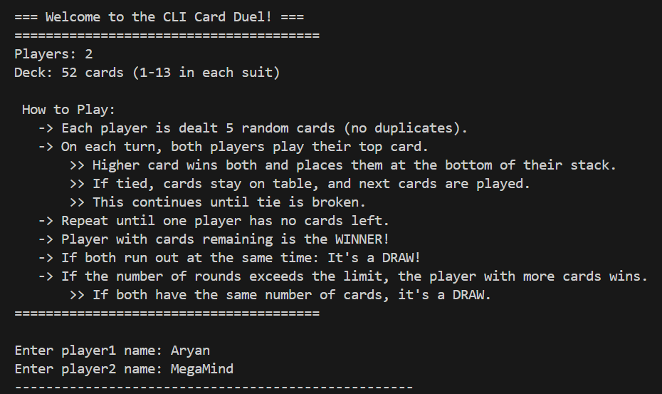
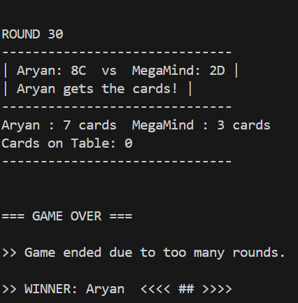

# ♠️ CLI Card Duel 🃏

A simple and fun terminal-based two-player card game written in **C++**!  
Players battle it out with randomly distributed cards, and the one with the stronger deck wins.

---

## 🛠️ Features

- Fully terminal-based, cross-platform gameplay.
- Randomized shuffling with no duplicate cards.
- Interactive prompts for player names.
- Smart tie-breaker logic (cards stay on table until tie breaks).
- Auto-detection of endless games (max round limit).
- Clean game-over display with winner announcement.
- Real-time display of remaining cards after each round.

---

## 🎮 How to Play

1. Two players enter their names.
2. Each player gets **5 random cards** from a standard 52-card deck.
3. In each round:
   - Players throw the top card from their stack.
   - The higher card wins both cards.
   - If the cards are equal, they stay on the table until the tie is broken.
4. This continues until:
   - One player runs out of cards → **Opponent wins**.
   - Both run out at the same time → **Draw**.
   - If the number of rounds exceeds the set limit:
     - Player with **more cards** wins.
     - If cards are equal → **Draw**.

---

## 🖼️ Preview

> 📸 Terminal preview — side-by-side screenshots of gameplay:

|  |  |
|:---------------------------------------:|:---------------------------------------:|
---

### Compile & Run

Make sure you have a C++ compiler installed (`g++` recommended).

```bash
g++ cardgame.cpp -o cardgame
./cardgame
```
For Windows Command Prompt, use:
```bash
cardgame.exe
```